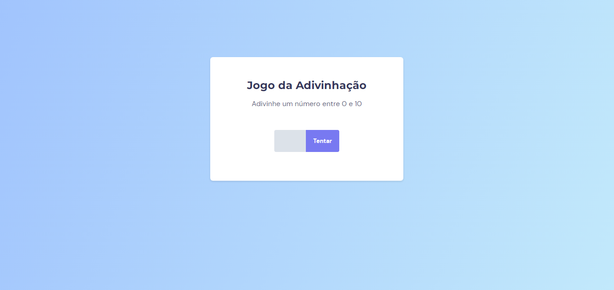

<h1 align="center"> Guess the Number </h1>

> [Technologies](#technologies)

> [Project](#project)

> [License](#license)

> [README in Portuguese](#readme-in-portuguese)

  

 

  

## Technologies

This project was developed with the following technologies:

- HTML
- CSS
- JavaScript
- Git e Github
- Figma

## Project

Built a guess-the-number game. The objective is to put into practice the concepts of DOM in JS.

- To access the finished project, [click here](https://fernandoalvesrufino.github.io/adivinhe-o-numero/).

 
## License

This project is licensed under the MIT.

---

by Fernando Rufino

`Project created by Rocketseat`

 
 
 

# README in portuguese
 
 

<h1 align="center"> Adivinhe o Número </h1>

> [Tecnologias](#tecnologias)

> [Projeto](#projeto)

> [Licença](#licença)

  

 

  

## Tecnologias

Esse projeto foi desenvolvido com as seguintes tecnologias:

- HTML
- CSS
- JavaScript
- Git e Github
- Figma

## Projeto

Construido um jogo de adivinhe o número. O objetivo é colocar em prática os conceitos de DOM no JS.

- Para acessar ao projeto finalizado, [clique aqui](https://fernandoalvesrufino.github.io/adivinhe-o-numero/).

 
## Licença

Esse projeto está sob a licença MIT.

---

by Fernando Rufino

> Projeto criado pela Rocketseat 
